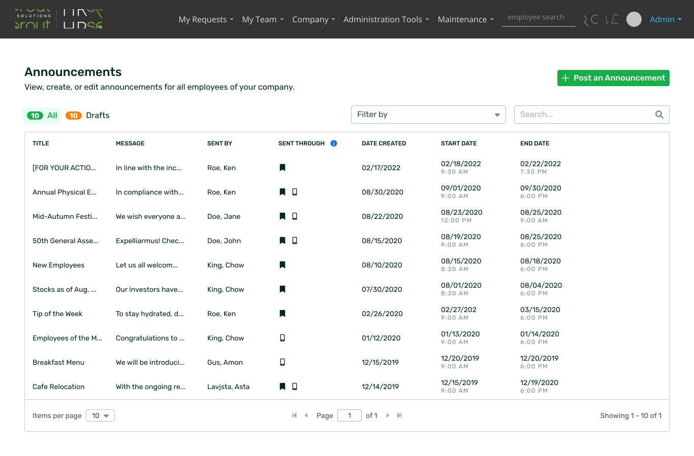
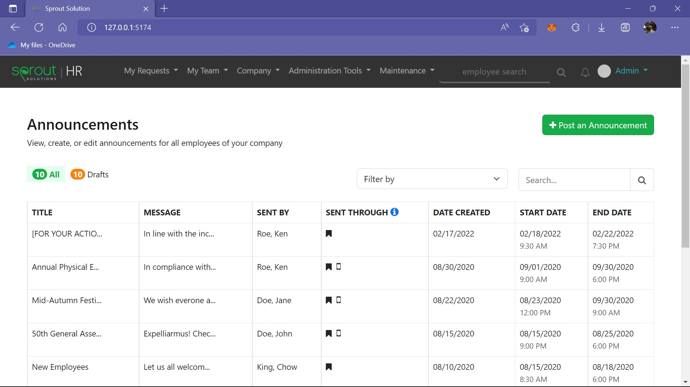
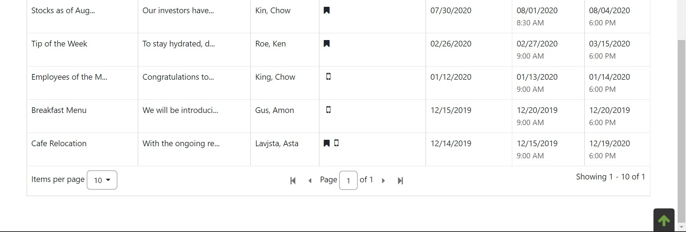

# Welcome to Sprout Solution!

## Overview

### The Objectives

In Sprout Solutions, aside from automating all the administrative tasks around HR and Payroll, We also do great designs built with UI/UX studies to smoothly navigate through the app. It’s important to our clients that our applications run correctly and efficiently while having overall great experience using it.

Should be able to:

Replicate the design as shown in the photo above as close as possible while implementing clean and good readable code.

- Must use modern frontend frameworks (React / Vue JS | Tailwind for CSS)
- Use Font Awesome for Icons
- Webpack or Vite for Build tool
- Optional use of SASS for styling and Typescript for Javascript

Requirements:

- Semantic HTML
- Modern CSS Application
- Good Folder Structure
- Data must be from javascript and not repeating html tag
- Produce an overall high-quality maintainable code
- Develop with Readability and Scalability in mind

### Screenshot

My Output

### Website

- Sprout Solution: [Sprout Solution](https://sprout.ph/)

### Built with

- Semantic HTML5 markup
- Flexbox
- CSS Grid
- Bootstrap
- JSON (Data handling)
